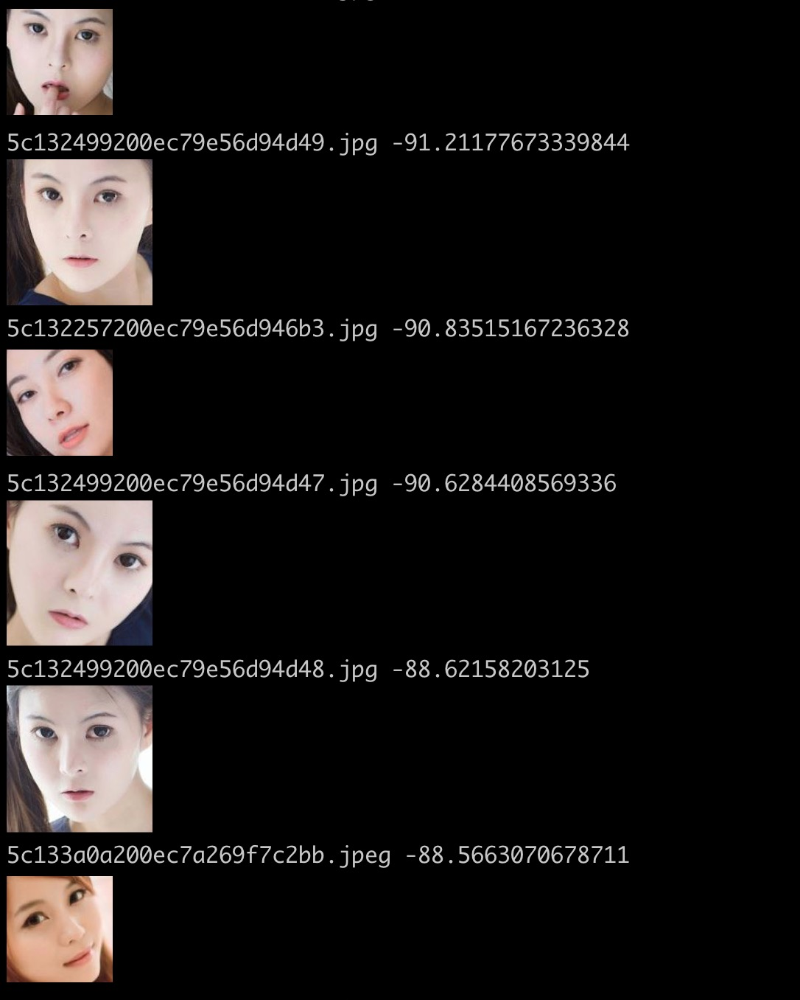

# MMFinder
一个美女图搜索应用的demo。

> 新增了ElasticSearch版本，配置简单，详细说明请查看：[elasticsearch分支](https://github.com/nladuo/MMFinder/tree/elasticsearch)。

## 环境
python3 + mongodb + SPTAG


## 安装依赖
### 安装Dlib
#### Mac or Linux
需要先安装好Cmake再通过pip安装即可。
```
pip3 install dlib
```

#### 对于Windows
对于python3.6可以通过whl快速安装。
```
pip install https://pypi.python.org/packages/da/06/bd3e241c4eb0a662914b3b4875fc52dd176a9db0d4a2c915ac2ad8800e9e/dlib-19.7.0-cp36-cp36m-win_amd64.whl#md5=b7330a5b2d46420343fbed5df69e6a3f
```
其他版本可以参考网上教程。

### 安装Python依赖
```
cd MMFinder
pip3 install -r requirements.txt
```

## 数据准备
### 1. 准备数据
爬取MM图片数据。
> 如果没有美女图片，可以用我的数据，Google Drive下载链接：[https://drive.google.com/file/d/1shZ3gx9nHPHUgylsZIrvWliwCh9TucAo/view?usp=sharing](https://drive.google.com/file/d/1shZ3gx9nHPHUgylsZIrvWliwCh9TucAo/view?usp=sharing)。解压密码：nladuo。

### 2. 过滤图片
只选出带一个脸的美女图，然后放到mongo里面
```bash
cd data_prprocess
python3 filter_images.py
```

## 特征工程
通过VGG-net对人脸图片特征提取，转换成dense-vector。
### 1. 下载VGG预训练模型
Google Drive：https://drive.google.com/file/d/1CPSeum3HpopfomUEK1gybeuIVoeJT_Eo/view?usp=sharing]
<br>
百度云链接:https://pan.baidu.com/s/1Dk40tW2lx1ezTda9IyIO9g  密码:0vc7
### 2. 使用VGG提取特征并构建数据集
```bash
cd data_prprocess
python3 feature_extraction.py
```

## 建立索引
### 1. 安装SPTAG，并启动Rpc服务
见：[Docker下SPTAG的安装与测试](https://www.jianshu.com/p/fcedf00eac32)


### 2. 对图片建立索引
```
cd index_construction
python3 export_SPTAG_indexbuilder_input.py
```
拷贝mm_index_input.txt到docker容器中
```bash
docker cp mm_index_input.txt 25042d741f07:/app/Release/
```

进入SPTAG的docker容器中，建立索引
```bash
docker attach 25042d741f07
./indexbuilder -d 2622 -v Float  -i ./mm_index_input.txt -o data/mm_index -a BKT -t 2
```

启动SPTAG搜索服务
```bash
python3 SPTAG_rpc_search_service.py
```

### 3. 搜索测试
对于mac用户，可以先安装``imgcat``，然后运行``index_construction/search_test.py``.

效果如下：


## 运行demo
### 运行演示网站
```
cd web_demo
python3 main.py
```

### 测试效果
打开[http://localhost:3889](http://localhost:3889)

上传一张图片测试，效果如下：

## Reference
- https://sefiks.com/2018/08/06/deep-face-recognition-with-keras/

## LICENSE
MIT
